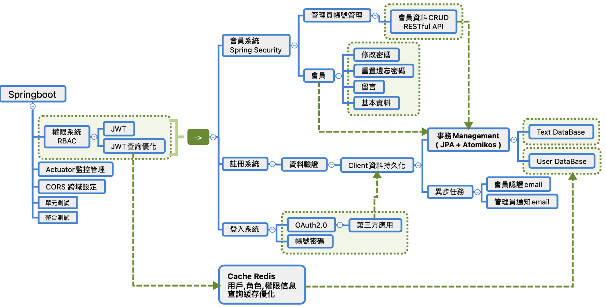
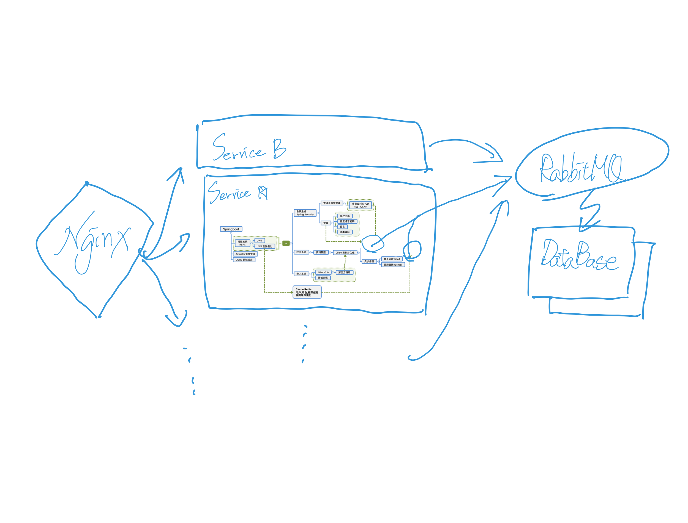

# Springboot-RBAC-Security-Redis-jpa-Mysql-Docker

<br>
<br>

### Structure



<br>
<br>
<br>
<br>

### Execute
```
cd Springboot-RBAC-Security-Redis-jpa-Mysql-Docker    (Folder)
```
```
AllStart.sh
```

<br>
<br>
<br>
<br>

### Feature

| Dependency | Version |
| :----: | :----: |
| Spring Boot | 2.2.5.RELEASE |
| Spring Web | by parent version |
| Spring Security | / |
| Spring Data Jpa | / |
| Spring log4j2 | / |
| Spring Mail | / |
| Spring Thymeleaf | / |
| Spring Jta Atomikos | / |
| Spring Cache | / |
| Spring Redis | / |
| Spring Actuator | / |
| lombok | 1.18.18 |
| okhttp3 | 4.7.2 |
| jjwt | 0.9.0 |
| Maven| 3 |
| Docker| v20.10.10 |

<br>
<br>
<br>
<br>

### Administrator Api
| api | Service | Method |
| :----: | :----: | :----: |
| localhost:8080 |  |  |
| /admin| 管理員中心 | GET |
| /read/{name} | 查詢會員資料 | GET |
| /create/{username}/{password}/{email} | 建立會員資料 | POST |
| /update/{username} | 更變會員資料 | PUT |
| /delete/{username} | 刪除會員資料 | DELETE |
| /admin/query/all/{page}/{size} | 查詢所有會員資訊 | GET |

### User Api
| api | Service | Method |
| :----: | :----: | :----: |
| localhost:8080 |  |  |
| /auth | 登入 | GET <br> POST |
| /refresh | 刷新登入 Token | POST |
| /member | 會員中心 | GET |
| /signup | 註冊 | GET <br> POST |
| /email/confirm | 驗證註冊 Email Token | GET |
| /user/reset/send | 重置密碼 | GET <br> POST |
| /user/change/pwd | 更變密碼 | GET <br> POST |
| /user/reset/confirm |  輸入新密碼 <br> 驗證更變密碼 Email Token | GET <br> POST |

### OAuth Api
| api | Service | Method |
| :----: | :----: | :----: |
| localhost:8080 |  |  |
| /oauth | 第三方登入 | GET |
| /callback | 驗證 授權碼 | GET |

<br>
<br>
<br>
<br>

### Troubleshooting

| Trouble | solve |
| :----: | :----: |
| 響應格式不一又複雜 | 預設是前後端分離，用 RESTful 格式，返回 json 給前端，<br>創建 ResponseMapper class 統一響應格式，<br> Status (boolean) + http code (響應 http 代碼)<br>+ Message(錯誤訊息給前端判斷) + Data(前端要的資料)。|
| 給用戶的不友好異常訊息<br>http code 簡化 | 創建 ExceptionIndividual class 使用 @ExceptionHandler 捕獲異常，<br> 將 http code 統一訂為 200 400 500 999(未知異常) 提供給前端。 |
| 統一異常處理的漏網之魚 | Spring Security 部分異常處理捕捉不到，<br>查看框架源碼發現異常在 filter 層就已經處理了，<br>@ExceptionHandler 只抓得到 controller 層的異常，<br>實作 Spring Security 異常處理 interface，調整 filter 順序。 |
| SQL 重複性高| 基本增刪改查權限系統，業務邏輯大多相同不太複雜，<br>將 spring data jdbc 改為 ORM 框架 spring data jpa ，<br>除了簡化開發流程還可以避免 SQL Injection |
| 寄信功能響應緩慢 | 將寄信功能改為異步 @Async，<br>使用 springboot 封裝好的線程池 ThreadPoolExecutor，<br>調整隊列小於線程數，避免死鎖，將鎖配置逾時時間 ，<br>不同業務邏輯線程池不共用。 |
|    |    |
| 一致性問題 | 儲存引擎改用 innoDB 可支持 @Transaction，<br>對增刪改的業務邏輯增加 @Transaction。|
| 隔離級別調整 | MySQL 預設 repeatable read，先改為 Read committed，<br>至少避免髒讀跟更新不一致，性能不會太差，<br>如其他業務邏輯需要處理不可重讀跟幻讀，<br>再看情況使用悲觀鎖或樂觀鎖來控制。 |
| SQL 查詢優化 | User 表的 username 欄位查詢頻繁，基數大，增添索引一般索引，<br>EXPLAIN 執行計畫數據顯示查詢效率提升:<br>type : ALL -> ref<br>row : max -> 1<br>對 Role 表 role 欄增添索引<br>type : ALL -> ref<br>對Url 表 url 欄增添索引<br>type : ALL -> ref <br> ~~(考慮使用 Partition 減少每次觸及到的資料量)~~|
| session 效能問題 | 授權的部分把 session 改用 jwt，再跟 spring security 做整合。 |
| JWT 查詢效率低落 | 改為 JWT 授權等於每次 request 都要去資料庫做查詢，<br>加上是多讀少寫的情境適合加 cache 優化查詢，用 Redis 實現 。<br>~~或是把所有權限資訊及可訪問的api全部存入 token，<br>這樣後續就不用每次都去數據庫查。但 token 大小有疑慮。~~ |
| 緩存穿透問題 | spring.cache.redis.cache-null-values=true<br>~~考慮優化緩存穿透 hash 或 boolen filter<br>考慮 優化 將 redis 做主從設計<br>~~ |
| 多資料庫一致性問題 | 引入 Spring Jta Atomikos 做 Transaction Managment |
|    |    |
| 打包路徑結構改變問題 |  使用 Maven 打包後會使結構路徑產生變化，<br>造成讀取不到靜態檔案預設位置，<br>application 設定檔案加上，<br>spring.thymeleaf.prefix=classpath:/templates。|

<br>
<br>
<br>
<br>

## Best Further

### 提高 QPS 跟 Concurrency 能力 ?
1. 多實例應用做水平擴充
2. nginx 做反向代理，負載均衡
3. RabbitMQ 更換 Atomikos 實現最終一致性<br>
   解決高耦合，阻塞。(Transactional Outbox OR CDC)
4. 資料庫可以再做 shading   

