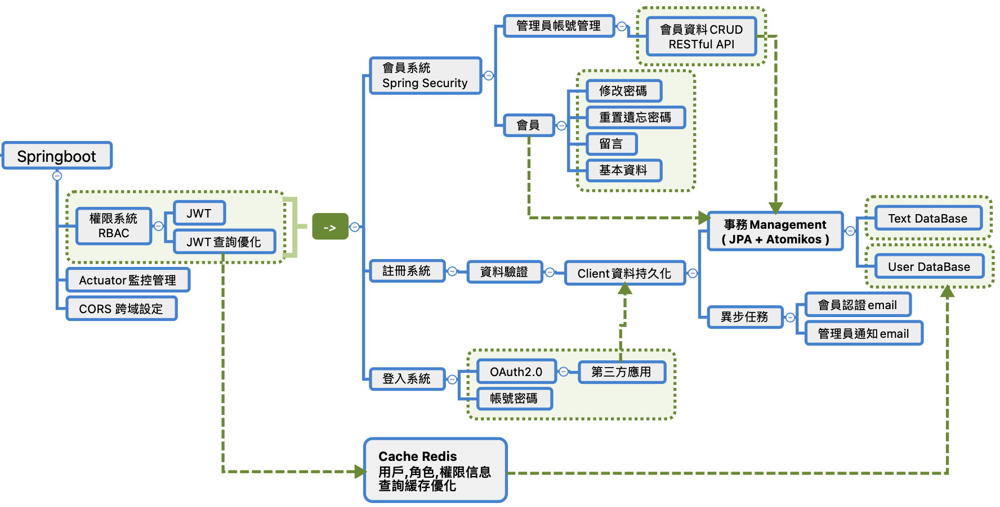

# Springboot-RBAC-Security-Redis-jpa-Mysql-Docker

<br>
<br>

### Structure



<br>
<br>

### Execute
```
cd Springboot-RBAC-Security-Redis-jpa-Mysql-Docker    (Folder)
```
```
AllStart.sh
```

<br>
<br>

### Feature

| Dependency | Version |
| :----: | :----: |
| Spring Boot | 2.2.5.RELEASE |
| Spring Web | by parent version |
| Spring Security | / |
| Spring Data Jpa | / |
| Spring log4j2 | / |
| Spring Mail | / |
| Spring Thymeleaf | / |
| Spring Jta Atomikos | / |
| Spring Cache | / |
| Spring Redis | / |
| Spring Actuator | / |
| lombok | 1.18.18 |
| okhttp3 | 4.7.2 |
| jjwt | 0.9.0 |
| Maven| 3 |
| Docker| v20.10.10 |

<br>
<br>
<br>
<br>

### Administrator Api
| api | Service | Method |
| :----: | :----: | :----: |
| localhost:8080 |  |  |
| /admin| 管理員中心 | GET |
| /read/{name} | 查詢會員資料 | GET |
| /create/{username}/{password}/{email} | 建立會員資料 | POST |
| /update/{username} | 更變會員資料 | PUT |
| /delete/{username} | 刪除會員資料 | DELETE |
| /admin/query/all/{page}/{size} | 查詢所有會員資訊 | GET |

### User Api
| api | Service | Method |
| :----: | :----: | :----: |
| localhost:8080 |  |  |
| /auth | 登入 | GET <br> POST |
| /refresh | 刷新登入 Token | POST |
| /member | 會員中心 | GET |
| /signup | 註冊 | GET <br> POST |
| /email/confirm | 驗證註冊 Email Token | GET |
| /user/reset/send | 重置密碼 | GET <br> POST |
| /user/change/pwd | 更變密碼 | GET <br> POST |
| /user/reset/confirm |  輸入新密碼 <br> 驗證更變密碼 Email Token | GET <br> POST |

### OAuth Api
| api | Service | Method |
| :----: | :----: | :----: |
| localhost:8080 |  |  |
| /oauth | 第三方登入 | GET |
| /callback | 驗證 授權碼 | GET |

<br>
<br>

### Figer out
```
swagger 解決 api doc 生成效率


```


<br>
<br>

### Best Further
1. Nacos Cluster with Nginx
1. Gateway Cluster
1. Nginx Cluster with KeepAlive


